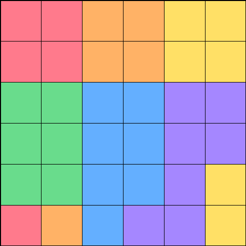
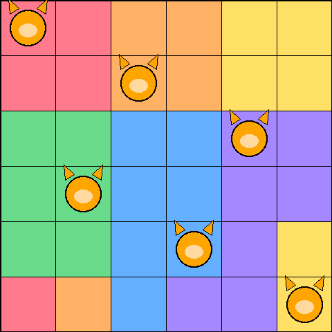

# 🐱 Mewdoku Solver

Upload a photo of a [Meowdoku](https://meowdoku.run/how-to-play) puzzle (colored-region cat logic), get the solution. One cat per row, column and color region — no two cats touching, even diagonally.

| Upload this | Get this |
|---|---|
|  |  |

Try it instantly: upload `assets/sample_board.png` in the app.

## Run it

```bash
pip install -r requirements.txt
streamlit run app.py
```

Then open the URL it prints (usually http://localhost:8501).

## How it works

1. **Upload** a straight-on photo in good light, press **Detect board** (grid size is detected automatically).
2. **Review** the detected board against your photo. Off? Retake and re-detect.
3. **Solve** places the cats (`solver.py`: backtracking with row/column/region + no-touch constraints; `vision.py`: grid warp + color clustering). Download the solution image.

## Project structure

```
app.py             Streamlit UI (upload → review → solve)
solver.py          Puzzle solver, no dependencies
vision.py          Grid detection + region color extraction (OpenCV)
.streamlit/        Theme tokens
assets/            Sample board + solution
```

## Deploy it free

[Streamlit Community Cloud](https://streamlit.io/cloud): New app → point at this repo → main file `app.py`. Done.

## Contributing

Issues and PRs welcome. Keep it dependency-light and test with:

```bash
python -m py_compile app.py solver.py vision.py
```

## License

MIT — see [LICENSE](LICENSE).
